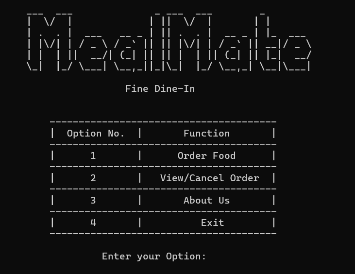
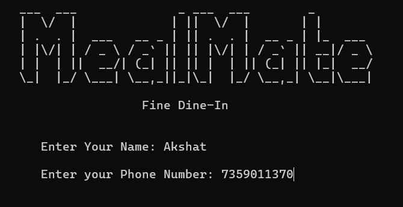
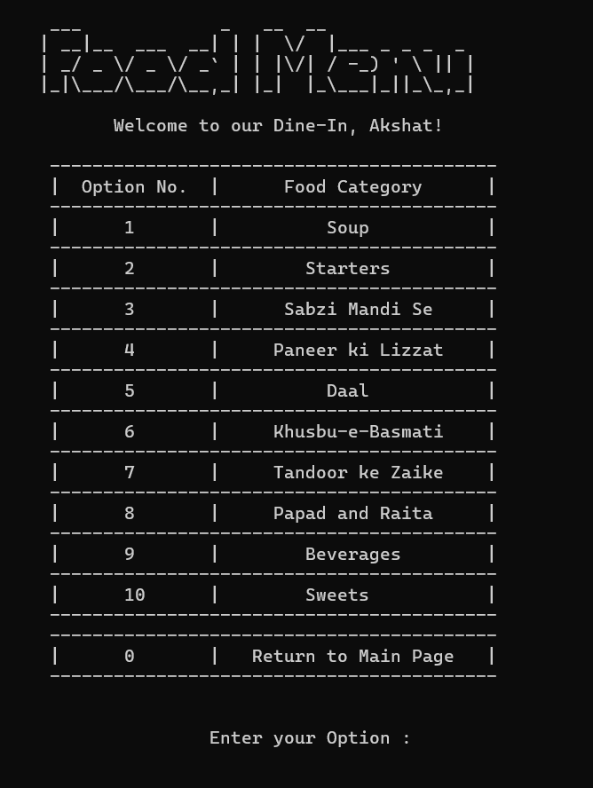

# 🥘 MealMate - Fine Dine-In Terminal App

MealMate is a terminal-based C++ application that simulates a dine-in restaurant food ordering experience. It provides users with a beautifully styled ASCII UI to navigate food categories, place orders, and make payments—just like at a real restaurant!

## 📸 Screenshots

### 🏠 Main Menu
<div style="display: flex; flex-wrap: wrap; gap: 10px;">
  
  
  
</div>

### 👤 Enter Customer Details


### 🍽️ Food Menu


### 💸 Payment Options


### 🧾 Bill Summary


### ℹ️ About Us


---

## 💡 Features

- 🍲 Menu-driven system with 10+ food categories
- 👤 Customer detail input (Name & Phone Number)
- 🛒 Food ordering with quantity input
- 🧾 Dynamic bill generation and order storage
- 💳 Payment simulation with options (Cash/UPI)
- 🔁 View or Cancel previous orders via phone number
- 🤝 Clean ASCII interface using `system("cls")` for transition effects
- 📄 Orders saved to `order.txt` file

---

## 🛠️ Tech Stack

- **Language:** C++
- **Paradigm:** Object-Oriented Programming
- **I/O Handling:** `ifstream`, `ofstream`
- **Terminal UI:** ASCII Art

---

## 🧠 Authors

- **Akshat Mistry**
- **Dhruv Jaradi**

---

## 🏁 How to Run

1. Clone the repository:
   ```bash
   git clone https://github.com/akshatkmistry/MealMate.git
   cd MealMate
   ```

2. Clone the repository:
   ```bash
   g++ main.cpp -o MealMate
   ```

3. Run the Application:
   ```bash
   ./MealMate
   ```

---

## 🤝 Contributing
🚀 Feel free to fork the repository and submit pull requests! Contributions are welcome.  

---
## 📧 Contact
For any queries, reach out via **GitHub Issues** or email at:  
✉️ **akshatkmistry007@gmail.com**  

Happy Coding! 🎉